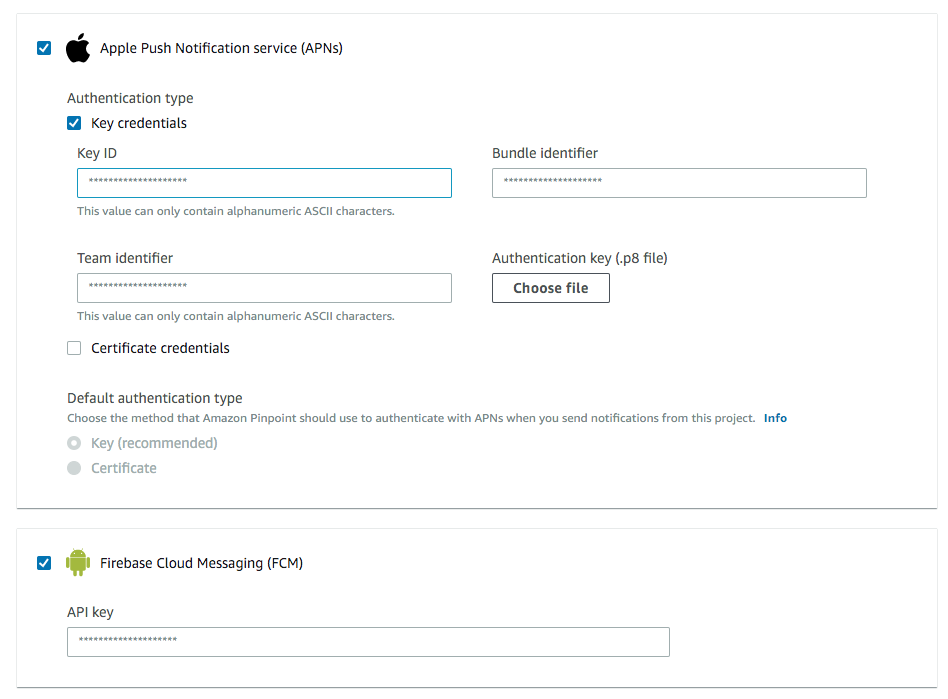

# Setup push notification
## Requirements
- React native wallet sdk `@cybavo/react-native-wallet-service@1.2.27`
- iOS wallet sdk `'CYBAVOWallet', '~> 1.2.161'`
- Android wallet sdk `com.cybavo.wallet:wallet-sdk-lib:1.2.1403`
## Installation and configuration
1. Install and configure AWS Amplify push notification, please refer to [this](https://aws-amplify.github.io/docs/js/push-notifications).
2. Setup AWS Mobile Hub.
    1. Create an app in [AWS Mobile Hub](https://console.aws.amazon.com/mobilehub/home#/). 
    2. Click on the app in AWS Mobile Hub. You can get app id from URL `https://console.aws.amazon.com/mobilehub/home#/xxxx_appid_xxxx/build`

    3. Create an IAM user with following policy applied. (Replace *xxxx_appid_xxxx* with your app id)
    ```
    {
        "Version": "2012-10-17",
        "Statement": [
            {
                "Sid": "VisualEditor0",
                "Effect": "Allow",
                "Action": "mobiletargeting:SendMessages",
                "Resource": [
                    "arn:aws:mobiletargeting:*:*:apps/xxxx_appid_xxxx/campaigns/*",
                    "arn:aws:mobiletargeting:*:*:apps/xxxx_appid_xxxx/segments/*",
                    "arn:aws:mobiletargeting:*:*:apps/xxxx_appid_xxxx/messages"
                ]
            }
        ]
    }
    ```
    4. Go to `https://console.aws.amazon.com/pinpoint/home#/apps/xxxx_appid_xxxx/settings/push/edit` to config your creditial for android/ios
    

    5. Follow steps in [Setting Up Push Notifications for Amazon Pinpoint](https://docs.aws.amazon.com/pinpoint/latest/developerguide/mobile-push.html) to setup your pinpoint projects

    6. Generates access key of IAM user and setup in **CYBAVO VAULT** -> **System Settings** -> **App Settings** -> 
    

    7. Ready to test!
## Working with the API
1. For iOS, you can set if it's apns sandbox while init WalletSdk
    ```javascript 1.8
   WalletSdk.init({
     endpoint: SERVICE_ENDPOINT,
     apiCode: SERVICE_API_CODE,
     apnsSandbox: true,
   });
    ```
2. Please remember to call `Auth.setPushDeviceToken(token)` after signin. Otherwise the device won't be able to receive notification successfully. 
    ```javascript 1.8
    PushNotification.onRegister((token) => {
     // Save the token and set push token after signin
      AsyncStorage.setItem('pushDeviceToken', token)
          .then(() =>
          console.debug('save pushDeviceToken done')
        );
    });
   
   // Make sure call setPushDeviceToken after signin. 
   function setPushDeviceToken() {
     return async (dispatch, getState) => {
       const token = await AsyncStorage.getItem('pushDeviceToken');
       const resp = await Auth.setPushDeviceToken(token);
       return resp;
     };
   }
    ```
3. Receive the notification in `PushNotification.onNotification(notification => {})` and we provided  `PushNotification.parse(json)` to help parsing the json string.
    
    iOS 
    ```javascript 1.8
    import { PushNotification as CYBAVOPushNotification } from '@cybavo/react-native-wallet-service';
    
    PushNotification.onNotification(notification => {
        let data = CYBAVOPushNotification.parse(
              JSON.stringify(notification._data.data.jsonBody)
            )
    });
    ```
    Android 
    ```javascript 1.8
    import { PushNotification as CYBAVOPushNotification } from '@cybavo/react-native-wallet-service';
    
    PushNotification.onNotification(notification => {
        let data = CYBAVOPushNotification.parse(
              notification.data['pinpoint.jsonBody']
            );
    });
    ```
4. The properties of `PushNotification.parse(json)` result are listed below

    Property    | Description  | Type  
    :------------|:------------|:-------
    walletID    | Wallet ID    |  number 
    currency    | Currency     |  number 
    tokenAddress  | Token address | string
    direction  | Transaction direction | Wallets.Transaction.Direction<br>(IN:0, OUT:1)
    amount  | Transaction amount | string
    fee  | Transaction fee | string
    fromAddress  | Transaction from address | string
    toAddress  | Transaction to address | string
    timestamp  | Transaction timestamp | number
    txid  | Transaction TXID | string
    description  | Transaction description | string

