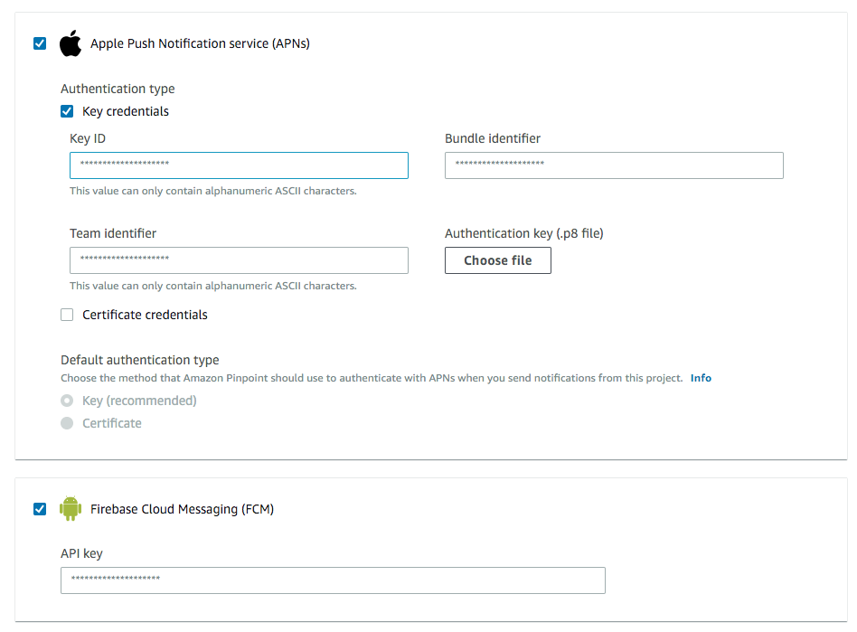
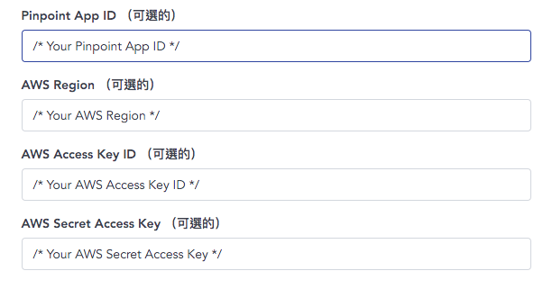

# Setup AWS Mobile Hub

1. Create an app in [AWS Mobile Hub](https://console.aws.amazon.com/mobilehub/home#/). 
2. Click on the app in AWS Mobile Hub. You can get app id from URL `https://console.aws.amazon.com/mobilehub/home#/xxxx_appid_xxxx/build`

3. Create an IAM user with following policy applied. (Replace *xxxx_appid_xxxx* with your app id)
```
{
    "Version": "2012-10-17",
    "Statement": [
        {
            "Sid": "VisualEditor0",
            "Effect": "Allow",
            "Action": "mobiletargeting:SendMessages",
            "Resource": [
                "arn:aws:mobiletargeting:*:*:apps/xxxx_appid_xxxx/campaigns/*",
                "arn:aws:mobiletargeting:*:*:apps/xxxx_appid_xxxx/segments/*",
                "arn:aws:mobiletargeting:*:*:apps/xxxx_appid_xxxx/messages"
            ]
        }
    ]
}
```
4. Go to `https://console.aws.amazon.com/pinpoint/home#/apps/xxxx_appid_xxxx/settings/push/edit` to config your creditial for android/ios


5. Follow steps in [Setting Up Push Notifications for Amazon Pinpoint](https://docs.aws.amazon.com/pinpoint/latest/developerguide/mobile-push.html) to setup your pinpoint projects

6. Generates access key of IAM user and setup in **CYBAVO VAULT** -> **System Settings** -> **App Settings** -> 


7. Ready to test!
